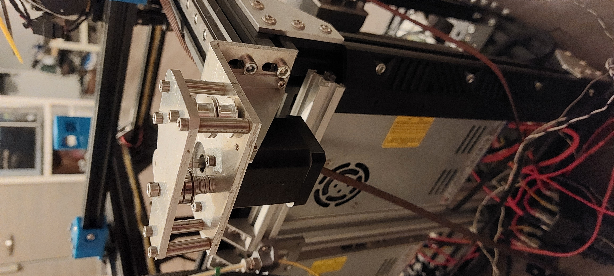
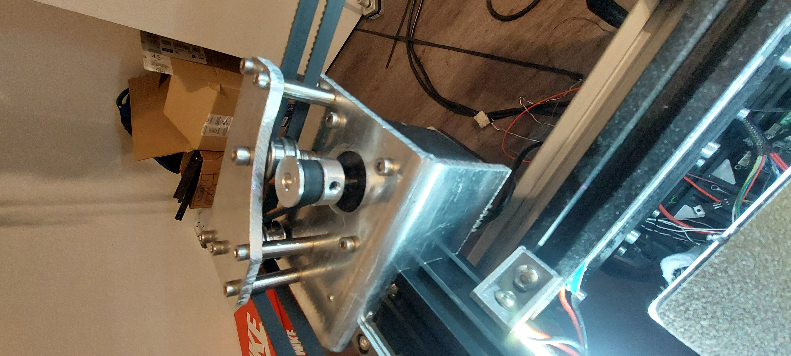
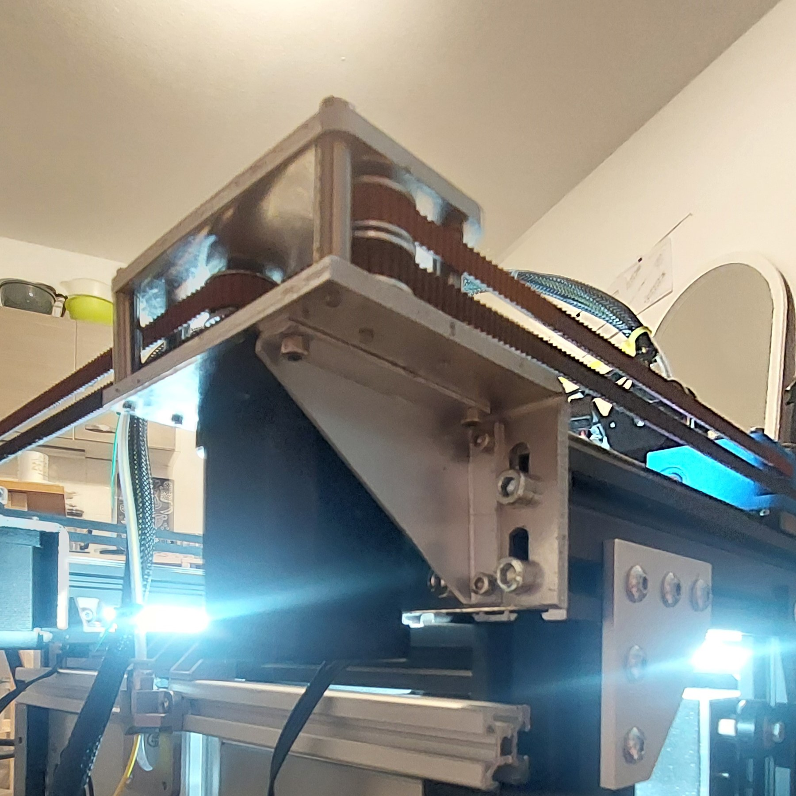

# Nema17-Sheetmetal-Motor-Mounts-CoreXY-
I developed a high-performance sheet-metal motor mount specifically for NEMA17 stepper motors in CoreXY 3D printers. The design delivers maximum rigidity to minimize deformation and significantly improves precision compared to typical 3D-printed mounts. Its aluminum surface enhances thermal performance by enabling effective heat dissipation and acting as a thermal buffer. The mount is engineered as a compact assembly for straightforward, cost-efficient manufacturing, combining precision, durability, and practicality.

Objectives for development of this sheetmetal part are:
- increased version compatibility [V-Slot-Wheels-Version; MGN9H-Rail-Version; MGN12H-Rail-Version]
- designed for Nema17x60mm works also with shorter models of Nema17 Steppers
- cost-efficient manufacturing
  - sheetmetal design
    - excellent material utilization
  - no CNC operated systems needed (but possible via third-party-manufacturers)
- optimized thermal specs
  - 200x better thermal conductivity
    - motor heat gets dissipated through sheetmetal mount
    - motormount offers more surface to dissipate heat through convection and radiation
  - lower heat capacity
- increased rigidty
  - 20x better rigitdy/Youngs Modulus
  - deviation in the hundredths to tenth mm range
- designed to work with idlers instead of flange bearing to prevent belts from slipping/drifting
- lighter motor mount design lowers the center of mass, which positivly influences [Input-Shaping](https://github.com/Frix-x/klippain-shaketune) results

# CAD
CAD-Files are available [here](./CAD).

# Drawing and Template
Drawing-Files are available [here](./drawings).

# Genereal Bill of Materials (BOM)
Tools:
- M3/M4 Drill
- M3/M4 Threading Tool

Assembly Parts:
- Nema17 Stepper motor
- GT2 20T Pulley
- 2x GT2 20T Idler (no teeth)
- MF 84 ZZ Flange Bearing (comes with Ender 3 V2; *Ender 3 may be diffrent!*)
- Spacer Sleeves
  - 5x 6x4x22 (inner- x outer- x length) -diameter
  - 1x 6x4x11 (inner- x outer- x length) -diameter
- Cylinder head screws
  - 4x M3x6
  - 4x M5x16
  - 6x M3x30
  - 4x M3x8
  - 1x M4x30
  - 8x M3 Washer
  - 2x M4 Washer (i ditched the 6x4x11 spacer sleeve and used instead many M4 Wahshers see [# Reference Pictures]
- 4mm aluminium sheetmetal (main-/top-body) see [here](./CAD) or [here](./drawings).
- 1.5mm aluminium sheetmetal see also [here](./CAD) or [here](./drawings).

# Manufacturing-tips
- holes in top-plate can/should be al little bigger than the ones from the main-body so screws don't get misaligned during assembly
  - also neutralisies sheer force on screws
**Parts and Drawing going to be updated by me soon**

# Reference Pictures

#
**This project is a user modification based on DuEnder by Sergei Irbis.**

DuEnder Discord: (https://discord.com/invite/ae44FHv786)

Sergei's YT-Channel: (https://www.youtube.com/@Irbis3D)
